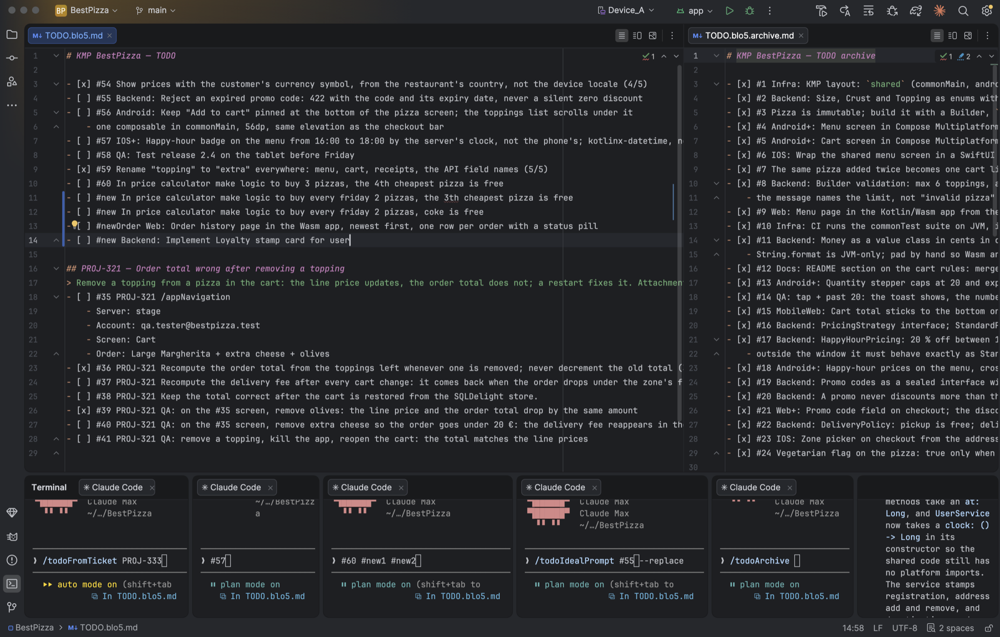
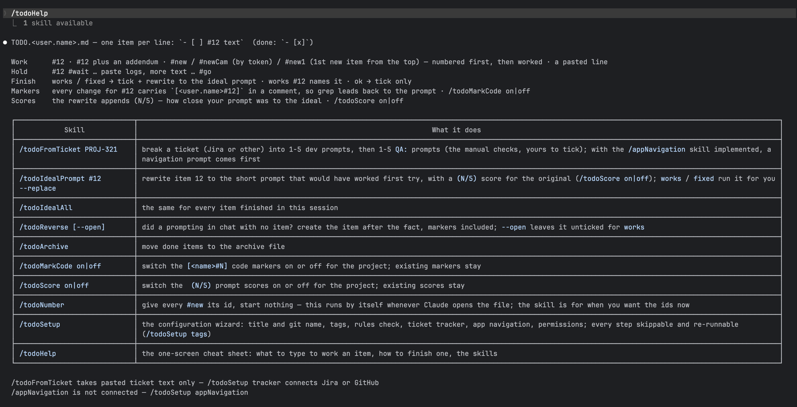

# Prompt TODO

Think of your todo list as:
- a prompt manager and a prompt tracker;
- a learning loop for prompting: each finished item comes back as the prompt you should have
  written, with a `(N/5)` score for the one you did write;
- the layer between the code base and the project-management system (Jira and friends).

Read [docs/todo-workflow.md](docs/todo-workflow.md) for the whole flow with examples.



*`TODO.<user.name>.md` on the left, the archive on the right, and one Claude Code terminal per item
below: `/todoFromTicket PROJ-333`, `#57`, `#60 #new1 #new2`, `/todoIdealPrompt #55 --replace`,
`/todoArchive`.*



*`/todoHelp` — the one-screen cheat sheet.*

## Install

### 1. Requirements

| Needed          | Notes                                                                                      |
|-----------------|--------------------------------------------------------------------------------------------|
| bash 3.2+       | macOS `/bin/bash`, any Linux, or **Git Bash** on Windows (part of Git for Windows)        |
| git             | the todo file is named after `git config user.name`                                        |
| Python 3        | under any of its names — `python3`, `python`, or the `py` launcher; the scripts find the one that works |
| `jq` (optional) | used when present; without it the hook and the config reads go through Python              |

The ticket tracker step needs the Atlassian MCP server (Jira) or the `gh` CLI (GitHub Issues);
both are optional and set up later by the wizard.

### 2. Run the installer

macOS and Linux:

```bash
git clone https://github.com/blackorange0506/prompt-todo ~/src/prompt-todo
cd ~/your/project
bash ~/src/prompt-todo/install.sh
```

Windows — the same commands from **Git Bash**, the shell Claude Code itself uses there (WSL
works too and is plain Linux):

```bash
git clone https://github.com/blackorange0506/prompt-todo /c/src/prompt-todo
cd /c/your/project
bash /c/src/prompt-todo/install.sh
```

Flags, all optional:

| Flag                       | Effect                                                                     |
|----------------------------|----------------------------------------------------------------------------|
| `--target DIR`             | install into `DIR` instead of the current directory                        |
| `--without-app-navigation` | skip the `/appNavigation` placeholder skill                                |
| `--dry-run`                | print what would change, write nothing                                     |
| `--force`                  | reset `config.json` from the example (the old one is kept as `config.json.bak`) |

### 3. Configure in Claude Code

Open Claude Code in the project and run:

```
/todoSetup
```

The wizard walks through seven steps — project title and git name, tags, rules check, ticket
tracker, app navigation, permissions, summary. Every step can be skipped and run again later
on its own (`/todoSetup tracker`); `/todoSetup --yes` takes every default. The flow already
works right after `install.sh` with a generic tag table and no tracker; `/todoSetup tags` trims
the table to the platforms the repo actually contains. `/todoHelp` prints the one-screen cheat
sheet: what to type to work an item, how to finish one, the skills.

If Claude Code is already open in the project (for example you ran the installer from its
terminal), restart it before `/todoSetup`: Claude Code only watches skill directories that existed
when the session started, so a session that predates `.claude/skills/` reports
`Unknown command: /todoSetup` until restarted. The installer says so when it detects that case.

### 4. Upgrade, uninstall

```bash
cd ~/src/prompt-todo && git pull
cd ~/your/project
bash ~/src/prompt-todo/install.sh        # upgrade: package files refreshed, your config, todo files and credentials untouched
bash ~/src/prompt-todo/uninstall.sh      # removes exactly what was added; --keep-config keeps config.json, --dry-run shows the list
```

`uninstall.sh` never touches `TODO.*.md`, the attachments directory, or anything you added
under `.claude/skills/appNavigation/`.

## What install.sh does

| Adds                                        | Purpose                                                       |
|---------------------------------------------|---------------------------------------------------------------|
| `.claude/prompt-todo/`                      | `config.json` (yours), `RULES.md` (generated), the scripts (`bin/py.sh` runs them with whatever Python 3 the machine has), the readme |
| `.claude/hooks/todo-confirm.sh`             | catches `works` / `fixed` so the rewrite never depends on memory |
| `.claude/skills/todo*`                      | `/todoSetup`, `/todoFromTicket`, `/todoIdealPrompt`, `/todoIdealAll`, `/todoNumber`, `/todoReverse`, `/todoArchive`, `/todoMarkCode`, `/todoScore`, `/todoHelp` |
| `.claude/skills/appNavigation/`             | the navigation placeholder, a description to implement (optional) |
| one line in `CLAUDE.md`                     | `@.claude/prompt-todo/RULES.md` — the rules are always in context |
| one entry in `.claude/settings.json`        | the hook (`bash "$CLAUDE_PROJECT_DIR"/.claude/hooks/todo-confirm.sh …`), merged next to whatever is already there |
| one line in `.gitignore`                    | the attachments directory                                     |
| two lines in `.gitattributes`               | keep the hook and the scripts LF, so a Windows checkout with `core.autocrlf=true` can still run them |

Commit `.claude/` (and the `.gitattributes` lines) with the project: the whole team then shares
one configuration, one rule set and one set of skills, and each person has their own todo file.

## Docs

- [docs/todo-workflow.md](docs/todo-workflow.md) — the flow, for people
- [docs/setup-wizard.md](docs/setup-wizard.md) — every wizard step: what it asks, what it writes
- [docs/todo-from-ticket.md](docs/todo-from-ticket.md) — `/todoFromTicket`: from a ticket to a block of dev and QA prompts
- [docs/jira-mcp.md](docs/jira-mcp.md) — connecting Jira (Atlassian MCP) or GitHub Issues
- [docs/app-navigation.md](docs/app-navigation.md) — what `/appNavigation` should do and how to connect yours

## Development

```bash
bash tests/run.sh              # hook, renderer, installer, docs
bash scripts/lint.sh           # shellcheck + py_compile
bash scripts/check_banlist.sh  # no traces of the project this was extracted from
```

CI runs everything on Linux, macOS and Windows (Git Bash, without `jq`, so the Python path is
what gets tested there; the macOS job also runs the tests under `/bin/bash` 3.2).

## License

MIT.
